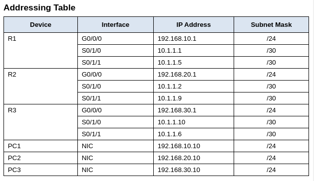

## Point-to-Point Single-Area OSPFv2 Configuration



### Part 1: Configure router IDs.

a. Start the OSPF routing process on all three routers. Use process ID 10.
b. Use the router-id command to set the OSPF IDs of the three routers as follows

```yaml
· R1: 1.1.1.1
· R2: 2.2.2.2
· R3: 3.3.3.3
```

On R1, R2, and R3:
```sh
enable
configure terminal
router ospf 10
router id [ID]
end
copy running-config startup config
```
### Part 2: Configure Networks for OSPF Routing

#### Step 1

a. Configure the routing process on R1 with the network statements and wildcard masks that are required to activate OSPF routing for all the attached networks. The network statement values should be the network or subnet addresses of the configured networks.

On R1:
```sh
enable
configure terminal
router ospf 10
network 192.168.10.0 0.0.0.255 area 0
network 10.1.1.1 0.0.0.3 area 0
network 10.1.1.5 0.0.0.3 area 0
end
copy running-config startup config
```
b. Verify that OSPF has been configured properly by the displaying the running configuration. If you find an error, delete the network statement using the no command and reconfigure it.

```sh
show ip protocols
```

#### Step 2

On router R2, configure OSPF using network commands with the IP addresses of the interfaces and quad-zero masks.

On R2:
```sh
enable
configure terminal
router ospf 10
network 192.168.20.1 0.0.0.0 area 0
network 10.1.1.2 0.0.0.0 area 0
network 10.1.1.9 0.0.0.0 area 0
end
copy running-config startup config
```
#### Step 3

On router R3, configure the required **interfaces** with OSPF.

On R3:
```sh
enable
configure terminal
interface g0/0/0
ip ospf 10 area 0
interface s0/1/0
ip ospf 10 area 0
interface s0/1/1
ip ospf 10 area 0
end
copy runnig-config startup-config
```
### Part 3: Configure Passive Interfaces

Configure the OSPF process on each of the three routers with the passive-interface command. The passive-interface command will prevent the OSPF process from sending unnecessary routing protocol traffic out LAN interfaces.
```yaml
Lan Interface:
· R1: g0/0/0
· R2: g0/0/0
· R3: g0/0/0
```
On R1, R2, R3:
```sh
enable
configure terminal
router ospf 10
passive-interface [LAN INTERFACE]
end
copy running-config startup-config
```
### Part 4: Verify OSPF Configuration

On R1, R2, R3:
```sh
enable
show ip protocols
```