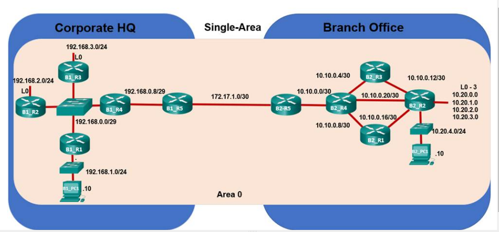

## Part 1




### Evaluate Single-Area OSPF Network Operation

In this part, CRC has expanded to a second location in Sao Paulo and currently uses single-area OSPF routing.

#### Step 1: Explore OSPF in the Corporate Headquarters.

a. Click the city icon for Sao Paulo. Notice that there are two buildings connected by a fiber link.

b. Click Corporate HQ, and then click the rack icon that represents the Sao Paulo HQ Wiring Closet.

c. Click B1_R4, and then select the CLI tab.

d. The terminal should show that G0/0/0 and G0/0/1 are up and that four adjacencies have been established, as shown below. If not, wait for the OSPF loading process to complete.

```bash
%LINEPROTO-5-UPDOWN: Line protocol on Interface GigabitEthernet0/0/0, changed state to up

%LINEPROTO-5-UPDOWN: Line protocol on Interface GigabitEthernet0/0/1, changed state to up

23:00:45: %OSPF-5-ADJCHG: Process 1, Nbr 172.17.1.1 on GigabitEthernet0/0/1 from LOADING to FULL, Loading Done

23:00:45: %OSPF-5-ADJCHG: Process 1, Nbr 192.168.2.1 on GigabitEthernet0/0/0 from LOADING to FULL, Loading Done

23:00:45: %OSPF-5-ADJCHG: Process 1, Nbr 192.168.1.1 on GigabitEthernet0/0/0 from LOADING to FULL, Loading Done

23:00:45: %OSPF-5-ADJCHG: Process 1, Nbr 192.168.3.1 on GigabitEthernet0/0/0 from LOADING to FULL, Loading Done

B1_R4>
```
e. Execute the **show ip route** command. Notice the size of the routing table and the routes learned via OSPF from the routers in the Sao Paulo Branch Office.

##### B1_R4 output:
```bash
Gateway of last resort is not set

     10.0.0.0/8 is variably subnetted, 11 subnets, 3 masks
O       10.10.0.0/30 [110/3] via 192.168.0.10, 00:05:17, GigabitEthernet0/0/1
O       10.10.0.4/30 [110/4] via 192.168.0.10, 00:05:07, GigabitEthernet0/0/1
O       10.10.0.8/30 [110/4] via 192.168.0.10, 00:05:17, GigabitEthernet0/0/1
O       10.10.0.12/30 [110/5] via 192.168.0.10, 00:05:17, GigabitEthernet0/0/1
O       10.10.0.16/30 [110/5] via 192.168.0.10, 00:05:17, GigabitEthernet0/0/1
O       10.10.0.20/30 [110/4] via 192.168.0.10, 00:05:17, GigabitEthernet0/0/1
O       10.20.0.1/32 [110/5] via 192.168.0.10, 00:05:17, GigabitEthernet0/0/1
O       10.20.1.1/32 [110/5] via 192.168.0.10, 00:05:17, GigabitEthernet0/0/1
O       10.20.2.1/32 [110/5] via 192.168.0.10, 00:05:17, GigabitEthernet0/0/1
O       10.20.3.1/32 [110/5] via 192.168.0.10, 00:05:17, GigabitEthernet0/0/1
O       10.20.4.0/24 [110/5] via 192.168.0.10, 00:05:17, GigabitEthernet0/0/1
     172.17.0.0/30 is subnetted, 1 subnets
O       172.17.1.0/30 [110/2] via 192.168.0.10, 00:05:17, GigabitEthernet0/0/1
     192.168.0.0/24 is variably subnetted, 4 subnets, 2 masks
C       192.168.0.0/29 is directly connected, GigabitEthernet0/0/0
L       192.168.0.4/32 is directly connected, GigabitEthernet0/0/0
C       192.168.0.8/29 is directly connected, GigabitEthernet0/0/1
L       192.168.0.9/32 is directly connected, GigabitEthernet0/0/1
O    192.168.1.0/24 [110/2] via 192.168.0.1, 00:05:17, GigabitEthernet0/0/0
     192.168.2.0/32 is subnetted, 1 subnets
O       192.168.2.1/32 [110/2] via 192.168.0.2, 00:05:17, GigabitEthernet0/0/0
     192.168.3.0/32 is subnetted, 1 subnets
O       192.168.3.1/32 [110/2] via 192.168.0.3, 00:05:17, GigabitEthernet0/0/0
```

f. On B1_R4, execute the **show ip ospf** command.

#### B1_R4 output:
```bash
 Routing Process "ospf 1" with ID 192.168.0.9
 Supports only single TOS(TOS0) routes
 Supports opaque LSA
 SPF schedule delay 5 secs, Hold time between two SPFs 10 secs
 Minimum LSA interval 5 secs. Minimum LSA arrival 1 secs
 Number of external LSA 0. Checksum Sum 0x000000
 Number of opaque AS LSA 0. Checksum Sum 0x000000
 Number of DCbitless external and opaque AS LSA 0
 Number of DoNotAge external and opaque AS LSA 0
 Number of areas in this router is 1. 1 normal 0 stub 0 nssa
 External flood list length 0
    Area BACKBONE(0)
        Number of interfaces in this area is 2
        Area has no authentication
        SPF algorithm executed 3 times
        Area ranges are
        Number of LSA 19. Checksum Sum 0x06cee1
        Number of opaque link LSA 0. Checksum Sum 0x000000
        Number of DCbitless LSA 0
        Number of indication LSA 0
        Number of DoNotAge LSA 0
        Flood list length 0
```

*Questions:*

- Record the number of times that the SPF algorithm has been executed.

- How many areas are displayed on router B1_R4?

g. Keep the console window for B1_R4 open. Click B1_R2, and then select the CLI tab. Execute the same two commands.

For the **show ip route** command, compare the output of B1_R2 to the output of B1_R4.

#### B1_R2 output:
```bash
Gateway of last resort is not set

     172.17.0.0/30 is subnetted, 1 subnets
O       172.17.1.0/30 [110/3] via 192.168.0.4, 00:24:09, GigabitEthernet0/0/0
     192.168.0.0/24 is variably subnetted, 3 subnets, 2 masks
C       192.168.0.0/29 is directly connected, GigabitEthernet0/0/0
L       192.168.0.2/32 is directly connected, GigabitEthernet0/0/0
O       192.168.0.8/29 [110/2] via 192.168.0.4, 00:24:09, GigabitEthernet0/0/0
O    192.168.1.0/24 [110/2] via 192.168.0.1, 00:24:09, GigabitEthernet0/0/0
     192.168.2.0/24 is variably subnetted, 2 subnets, 2 masks
C       192.168.2.0/24 is directly connected, Loopback0
L       192.168.2.1/32 is directly connected, Loopback0
     192.168.3.0/32 is subnetted, 1 subnets
O       192.168.3.1/32 [110/2] via 192.168.0.3, 00:24:09, GigabitEthernet0/0/0
```
Notice that the B1_R2 routing table, with the exception of local and connected routes, has learned the same routes via OSPF as B1_R4.

*Question:*

- Record the number of times that the SPF algorithm has been executed.

### Step 2: Explore OSPF in the Branch Office.

a. Keep the console windows open for both routers B1_R2 and B1_R4.

b. On the blue tool bar at the top, click the **Back** level button twice to return to the Sao Paulo city view. You can also use the shortcut keys **Alt+Left** arrow key.

c. Click Branch Office, and then the rack icon that represents the Sao Paulo Branch Office Wiring Closet.

d. Click B2_R3, and then select the CLI tab.

e. The terminal should show that G1/0 and G2/0 are up and that two adjacencies have been established, as shown below.

```bash
%LINK-5-CHANGED: Interface GigabitEthernet1/0, changed state to up

%LINEPROTO-5-UPDOWN: Line protocol on Interface GigabitEthernet1/0, changed state to up

%LINK-5-CHANGED: Interface GigabitEthernet2/0, changed state to up

%LINEPROTO-5-UPDOWN: Line protocol on Interface GigabitEthernet2/0, changed state to up

02:00:45: %OSPF-5-ADJCHG: Process 1, Nbr 4.4.4.4 on GigabitEthernet1/0 from LOADING to FULL, Loading Done

02:00:45: %OSPF-5-ADJCHG: Process 1, Nbr 2.2.2.2 on GigabitEthernet2/0 from LOADING to FULL, Loading Done

B2_R3>
``` 
f. Execute the **show ip route** command. Compare the output of B2_R3 to the output of B1_R4 or B1_R2.

#### B2_R3 output:
```bash
Gateway of last resort is not set

     10.0.0.0/8 is variably subnetted, 11 subnets, 3 masks
O       10.10.0.0/30 [110/2] via 10.10.0.5, 00:31:32, GigabitEthernet1/0
C       10.10.0.4/30 is directly connected, GigabitEthernet1/0
O       10.10.0.8/30 [110/2] via 10.10.0.5, 00:31:32, GigabitEthernet1/0
C       10.10.0.12/30 is directly connected, GigabitEthernet2/0
O       10.10.0.16/30 [110/2] via 10.10.0.14, 00:31:32, GigabitEthernet2/0
O       10.10.0.20/30 [110/2] via 10.10.0.5, 00:31:32, GigabitEthernet1/0
                      [110/2] via 10.10.0.14, 00:31:32, GigabitEthernet2/0
O       10.20.0.1/32 [110/2] via 10.10.0.14, 00:31:32, GigabitEthernet2/0
O       10.20.1.1/32 [110/2] via 10.10.0.14, 00:31:32, GigabitEthernet2/0
O       10.20.2.1/32 [110/2] via 10.10.0.14, 00:31:32, GigabitEthernet2/0
O       10.20.3.1/32 [110/2] via 10.10.0.14, 00:31:32, GigabitEthernet2/0
O       10.20.4.0/24 [110/2] via 10.10.0.14, 00:31:32, GigabitEthernet2/0
     172.17.0.0/30 is subnetted, 1 subnets
O       172.17.1.0 [110/3] via 10.10.0.5, 00:31:32, GigabitEthernet1/0
     192.168.0.0/29 is subnetted, 2 subnets
O       192.168.0.0 [110/5] via 10.10.0.5, 00:31:22, GigabitEthernet1/0
O       192.168.0.8 [110/4] via 10.10.0.5, 00:31:22, GigabitEthernet1/0
O    192.168.1.0/24 [110/6] via 10.10.0.5, 00:31:22, GigabitEthernet1/0
     192.168.2.0/32 is subnetted, 1 subnets
O       192.168.2.1 [110/6] via 10.10.0.5, 00:31:22, GigabitEthernet1/0
     192.168.3.0/32 is subnetted, 1 subnets
O       192.168.3.1 [110/6] via 10.10.0.5, 00:31:22, GigabitEthernet1/0
```
Notice that other than a few connected or local routes, the same networks are displayed.

g. On B2_R3, execute the **show ip ospf** command.

#### B2_R3 output:
```bash
Routing Process "ospf 1" with ID 3.3.3.3
Supports only single TOS(TOS0) routes
Supports opaque LSA
SPF schedule delay 5 secs, Hold time between two SPFs 10 secs
Minimum LSA interval 5 secs. Minimum LSA arrival 1 secs
Number of external LSA 0. Checksum Sum 0x000000
Number of opaque AS LSA 0. Checksum Sum 0x000000
Number of DCbitless external and opaque AS LSA 0
Number of DoNotAge external and opaque AS LSA 0
Number of areas in this router is 1. 1 normal 0 stub 0 nssa
External flood list length 0
    Area BACKBONE(0)
        Number of interfaces in this area is 2
        Area has no authentication
        SPF algorithm executed 4 times
        Area ranges are
        Number of LSA 19. Checksum Sum 0x07d37a
        Number of opaque link LSA 0. Checksum Sum 0x000000
        Number of DCbitless LSA 0
        Number of indication LSA 0
        Number of DoNotAge LSA 0
        Flood list length 0

```
*Questions:*

- Record the number of times that the SPF algorithm has been executed.

- How many areas are displayed on router B2_R3?

h. Keep the console window open. Click B2_R1, and then select the CLI tab. The output should be similar to the output of B2_R3.

i. On B2_R1, click Physical tab and power the device off to simulate a power outage. Networks 10.10.0.8/30 and 10.10.0.16/36 will no longer be advertised.

j. Issue the **show ip route** and the **show ip ospf** commands on one router in the Branch office and one router in the Head Office.

*Question:*
- Are the two networks missing from both of the routing tables and have the SPF algorithm executions increased?

**Note**: Every router, in both buildings, has been forced to do extra SPF algorithm executions. Because all of the routers are in the same area, every change to the topology will cause OSPF to execute the SPF algorithm on each router. This is not a problem for small networks, but for large networks, excessive SPF calculations can impact network performance. The solution is to divide the OSPF topology into multiple areas. Changes in topology in one area will not cause SPF recalculations in other areas.

You have completed Part 1: Evaluate Network Operation of Single-Area OSPF.

To continue to Part 2: Evaluate Multiarea OSPF Network Operation, close this Packet Tracer file. Return to the online course and open the Multiarea OSPF Exploration - Physical Mode (Part2) Packet Tracer file.