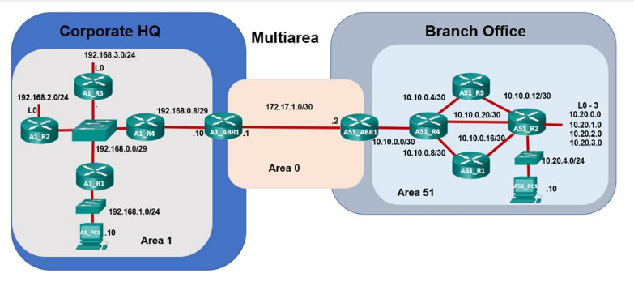

## Part 2: Evaluate Multiarea OSPF Network Operation



### Step 1: Explore OSPF Area 1 devices in the Corporate HQ and Branch Office.

a. Click the city icon for Sao Paulo, and then click Corporate HQ. Click the rack icon that represents the Sao Paulo HQ Wiring Closet.

b. Click A1_ABR1, and then select the CLI tab.

c. The terminal should show that G0/0 and G1/0 are up and that two adjacencies have been established, as shown below. If not, wait for the OSPF loading process to complete.

```bash
%LINEPROTO-5-UPDOWN: Line protocol on Interface GigabitEthernet1/0, changed state to up

%LINEPROTO-5-UPDOWN: Line protocol on Interface GigabitEthernet0/0, changed state to up

23:00:40: %OSPF-5-ADJCHG: Process 1, Nbr 172.17.1.2 on GigabitEthernet0/0 from LOADING to FULL, Loading Done

23:00:45: %OSPF-5-ADJCHG: Process 1, Nbr 192.168.0.9 on GigabitEthernet1/0 from LOADING to FULL, Loading Done

A1_ABR1>
```

d. Execute the **show ip route** command.

#### A1_ABR1 output:
```bash
O IA 10.0.0.0/8 [110/2] via 172.17.1.2, 00:09:14, GigabitEthernet0/0
     172.17.0.0/30 is subnetted, 1 subnets
C       172.17.1.0 is directly connected, GigabitEthernet0/0
     192.168.0.0/29 is subnetted, 2 subnets
O       192.168.0.0 [110/2] via 192.168.0.9, 00:09:04, GigabitEthernet1/0
C       192.168.0.8 is directly connected, GigabitEthernet1/0
O    192.168.1.0/24 [110/3] via 192.168.0.9, 00:09:04, GigabitEthernet1/0
     192.168.2.0/32 is subnetted, 1 subnets
O       192.168.2.1 [110/3] via 192.168.0.9, 00:09:04, GigabitEthernet1/0
     192.168.3.0/32 is subnetted, 1 subnets
O       192.168.3.1 [110/3] via 192.168.0.9, 00:08:54, GigabitEthernet1/0
```
Notice that the routing table on router A1_ABR1 is shorter than it was on router B1_R5 in the single-area OPSF example in Part 1.

*Question:*

- How are the networks from Area 51 displayed in the routing table of A1_ABR1?

e. Execute the **show ip ospf** command on router A1_ABR1.
#### A1_ABR1 output:
```bash
Routing Process "ospf 1" with ID 172.17.1.1
Supports only single TOS(TOS0) routes
Supports opaque LSA
It is an area border router
SPF schedule delay 5 secs, Hold time between two SPFs 10 secs
Minimum LSA interval 5 secs. Minimum LSA arrival 1 secs
Number of external LSA 0. Checksum Sum 0x000000
Number of opaque AS LSA 0. Checksum Sum 0x000000
Number of DCbitless external and opaque AS LSA 0
Number of DoNotAge external and opaque AS LSA 0
Number of areas in this router is 2. 2 normal 0 stub 0 nssa
External flood list length 0
    Area 1
        Number of interfaces in this area is 1
        Area has no authentication
        SPF algorithm executed 4 times
        Area ranges are
        Number of LSA 9. Checksum Sum 0x03611a
        Number of opaque link LSA 0. Checksum Sum 0x000000
        Number of DCbitless LSA 0
        Number of indication LSA 0
        Number of DoNotAge LSA 0
        Flood list length 0
    Area BACKBONE(0)
        Number of interfaces in this area is 1
        Area has no authentication
        SPF algorithm executed 5 times
        Area ranges are
        Number of LSA 9. Checksum Sum 0x033c34
        Number of opaque link LSA 0. Checksum Sum 0x000000
        Number of DCbitless LSA 0
        Number of indication LSA 0
        Number of DoNotAge LSA 0
        Flood list length 0
```
*Questions:*
- Which areas are displayed on router A1_ABR1?

Record the number of times that the SPF algorithm has been executed in each area.

f. Keep the console window for A1_ABR1 open and select router A1_R2. Execute the **show ip route** and **show ip ospf** commands, and then compare the output with the output on A1_ABR1.

#### A1_R2 show ip route:
```bash
Gateway of last resort is not set

O IA 10.0.0.0/8 [110/4] via 192.168.0.4, 00:16:47, GigabitEthernet0/0/0
     172.17.0.0/30 is subnetted, 1 subnets
O IA    172.17.1.0/30 [110/3] via 192.168.0.4, 00:16:47, GigabitEthernet0/0/0
     192.168.0.0/24 is variably subnetted, 3 subnets, 2 masks
C       192.168.0.0/29 is directly connected, GigabitEthernet0/0/0
L       192.168.0.2/32 is directly connected, GigabitEthernet0/0/0
O       192.168.0.8/29 [110/2] via 192.168.0.4, 00:16:47, GigabitEthernet0/0/0
O    192.168.1.0/24 [110/2] via 192.168.0.1, 00:16:47, GigabitEthernet0/0/0
     192.168.2.0/24 is variably subnetted, 2 subnets, 2 masks
C       192.168.2.0/24 is directly connected, Loopback0
L       192.168.2.1/32 is directly connected, Loopback0
     192.168.3.0/32 is subnetted, 1 subnets
O       192.168.3.1/32 [110/2] via 192.168.0.3, 00:16:47, GigabitEthernet0/0/0
```
#### A1_r2 show ip ospf:
```bash
Routing Process "ospf 1" with ID 192.168.2.1
Supports only single TOS(TOS0) routes
Supports opaque LSA
SPF schedule delay 5 secs, Hold time between two SPFs 10 secs
Minimum LSA interval 5 secs. Minimum LSA arrival 1 secs
Number of external LSA 0. Checksum Sum 0x000000
Number of opaque AS LSA 0. Checksum Sum 0x000000
Number of DCbitless external and opaque AS LSA 0
Number of DoNotAge external and opaque AS LSA 0
Number of areas in this router is 1. 1 normal 0 stub 0 nssa
External flood list length 0
    Area 1
        Number of interfaces in this area is 2
        Area has no authentication
        SPF algorithm executed 3 times
        Area ranges are
        Number of LSA 9. Checksum Sum 0x03611a
        Number of opaque link LSA 0. Checksum Sum 0x000000
        Number of DCbitless LSA 0
        Number of indication LSA 0
        Number of DoNotAge LSA 0
        Flood list length 0
```

Similar networks should be displayed and the number of SPF algorithm executions should be similar.

*Question:*
- Record the number of SPF algorithm executions.

### Step 2: Explore the impact of changes in Area 51.

a. Keep the console windows open for both routers A1_ABR1 and A1_R2.

b. On the blue tool bar at the top, click the Back level button twice to return to the Sao Paulo city view. You can also use the shortcut keys Alt+Left arrow key.

c. Click Branch Office, and then the rack icon that represents the Sao Paulo Branch Office Wiring Closet.

d. Click A51_R4, and then select the CLI tab.

e. The terminal should show that all four Gigabit Ethernet interfaces are up and that four adjacencies have been established.

```bash
%LINEPROTO-5-UPDOWN: Line protocol on Interface GigabitEthernet4/0, changed state to up

%LINK-5-CHANGED: Interface GigabitEthernet1/0, changed state to up

%LINEPROTO-5-UPDOWN: Line protocol on Interface GigabitEthernet1/0, changed state to up

%LINK-5-CHANGED: Interface GigabitEthernet2/0, changed state to up

%LINEPROTO-5-UPDOWN: Line protocol on Interface GigabitEthernet2/0, changed state to up

%LINK-5-CHANGED: Interface GigabitEthernet3/0, changed state to up

%LINEPROTO-5-UPDOWN: Line protocol on Interface GigabitEthernet3/0, changed state to up

23:00:40: %OSPF-5-ADJCHG: Process 1, Nbr 1.1.1.1 on GigabitEthernet1/0 from LOADING to FULL, Loading Done

23:00:40: %OSPF-5-ADJCHG: Process 1, Nbr 172.17.1.2 on GigabitEthernet4/0 from LOADING to FULL, Loading Done

23:00:40: %OSPF-5-ADJCHG: Process 1, Nbr 3.3.3.3 on GigabitEthernet3/0 from LOADING to FULL, Loading Done

23:00:45: %OSPF-5-ADJCHG: Process 1, Nbr 2.2.2.2 on GigabitEthernet2/0 from LOADING to FULL, Loading Done

A51_R4>
```

f. Execute the **show ip route** command. Compare the output of A51_R4 to the output of A1_ABR1 and A1_R2.

#### A51_R4 output:
```bash
Gateway of last resort is not set

     10.0.0.0/8 is variably subnetted, 8 subnets, 3 masks
C       10.10.0.0/30 is directly connected, GigabitEthernet4/0
C       10.10.0.4/30 is directly connected, GigabitEthernet3/0
C       10.10.0.8/30 is directly connected, GigabitEthernet1/0
O       10.10.0.12/30 [110/2] via 10.10.0.22, 00:27:08, GigabitEthernet2/0
                      [110/2] via 10.10.0.6, 00:27:08, GigabitEthernet3/0
O       10.10.0.16/30 [110/2] via 10.10.0.10, 00:27:08, GigabitEthernet1/0
                      [110/2] via 10.10.0.22, 00:27:08, GigabitEthernet2/0
C       10.10.0.20/30 is directly connected, GigabitEthernet2/0
O       10.20.0.1/32 [110/2] via 10.10.0.22, 00:27:08, GigabitEthernet2/0
O       10.20.4.0/24 [110/2] via 10.10.0.22, 00:27:08, GigabitEthernet2/0
     172.17.0.0/30 is subnetted, 1 subnets
O IA    172.17.1.0 [110/2] via 10.10.0.2, 00:27:18, GigabitEthernet4/0
     192.168.0.0/29 is subnetted, 2 subnets
O IA    192.168.0.0 [110/4] via 10.10.0.2, 00:26:58, GigabitEthernet4/0
O IA    192.168.0.8 [110/3] via 10.10.0.2, 00:27:08, GigabitEthernet4/0
O IA 192.168.1.0/24 [110/5] via 10.10.0.2, 00:26:58, GigabitEthernet4/0
     192.168.2.0/32 is subnetted, 1 subnets
O IA    192.168.2.1 [110/5] via 10.10.0.2, 00:26:58, GigabitEthernet4/0
     192.168.3.0/32 is subnetted, 1 subnets
O IA    192.168.3.1 [110/5] via 10.10.0.2, 00:26:48, GigabitEthernet4/0
```

Notice that other than a few connected or local routes, the same networks are displayed.

*Question:*
- Record the number of IA routes displayed.

g. Execute the **show ip ospf** command.

#### A51_R4 output:
```bash
 Routing Process "ospf 1" with ID 4.4.4.4
 Supports only single TOS(TOS0) routes
 Supports opaque LSA
 SPF schedule delay 5 secs, Hold time between two SPFs 10 secs
 Minimum LSA interval 5 secs. Minimum LSA arrival 1 secs
 Number of external LSA 0. Checksum Sum 0x000000
 Number of opaque AS LSA 0. Checksum Sum 0x000000
 Number of DCbitless external and opaque AS LSA 0
 Number of DoNotAge external and opaque AS LSA 0
 Number of areas in this router is 1. 1 normal 0 stub 0 nssa
 External flood list length 0
    Area 51
        Number of interfaces in this area is 4
        Area has no authentication
        SPF algorithm executed 9 times
        Area ranges are
        Number of LSA 17. Checksum Sum 0x0455c7
        Number of opaque link LSA 0. Checksum Sum 0x000000
        Number of DCbitless LSA 0
        Number of indication LSA 0
        Number of DoNotAge LSA 0
        Flood list length 0
```
*Question:*
- Record the number of SPF calculations.

h. Keep the console window for A51_R4 open. Click A51_R2. On the Physical tab, turn the power off to simulate a power failure.

i. Return to the console window for A51_R4. You should see a console message that the adjacency with A51_R2 is down.

```bash
%LINK-3-UPDOWN: Interface GigabitEthernet2/0, changed state to down

%LINEPROTO-5-UPDOWN: Line protocol on Interface GigabitEthernet2/0, changed state to down

23:30:33: %OSPF-5-ADJCHG: Process 1, Nbr 2.2.2.2 on GigabitEthernet2/0 from FULL to DOWN, Neighbor Down: Interface down or detached
```

j. Re-issue the **show ip route** and **show ip ospf** commands.

*Questions:*
- Have the SPF algorithm executions increased?

- Record the number of SPF algorithm executions.

- What networks are missing from the A51_R4 routing table?

k. Navigate to A1_R2 and issue the **show ip route** and **show ip ospf** commands again.

*Questions:*
- Is the summary route for Area 51 still in the routing table?

- Has the value for the SPF algorithm executions increased from Step 1g?

- Will a ping or a tracert between A1_PC1 (192.168.1.10) and A51_PC1 (10.20.4.10) be successful?

**Note:** The area 51 border router, A51_ABR1 has summarized the 10.0.0.0/8 networks and is advertising the summary route to all the other areas. Topology changes in area 51, such as power failures, interface disconnects, or OSPF network changes, will cause SPF recalculations on all routers within area 51 but will NOT cause SPF recalculations in area 1.

### Step 3: Summarize the Area 1 routes to be sent to Area 51.

a. Select router A51_R4 and execute the **show ip route**.

#### A51_R4 output:
```bash
Gateway of last resort is not set

     10.0.0.0/30 is subnetted, 3 subnets
C       10.10.0.0 is directly connected, GigabitEthernet4/0
C       10.10.0.4 is directly connected, GigabitEthernet3/0
C       10.10.0.8 is directly connected, GigabitEthernet1/0
     172.17.0.0/30 is subnetted, 1 subnets
O IA    172.17.1.0 [110/2] via 10.10.0.2, 00:44:18, GigabitEthernet4/0
     192.168.0.0/29 is subnetted, 2 subnets
O IA    192.168.0.0 [110/4] via 10.10.0.2, 00:43:58, GigabitEthernet4/0
O IA    192.168.0.8 [110/3] via 10.10.0.2, 00:44:08, GigabitEthernet4/0
O IA 192.168.1.0/24 [110/5] via 10.10.0.2, 00:43:58, GigabitEthernet4/0
     192.168.2.0/32 is subnetted, 1 subnets
O IA    192.168.2.1 [110/5] via 10.10.0.2, 00:43:58, GigabitEthernet4/0
     192.168.3.0/32 is subnetted, 1 subnets
O IA    192.168.3.1 [110/5] via 10.10.0.2, 00:43:48, GigabitEthernet4/0
```
Compare the output of A51_R4 to the output of A1_R4. You should notice that all of the 192.168.0.0 networks from area 1 are showing inside the routing table.

*Questions:*
- If a cleaning crew accidentally removed the cable on A1_R1 (192.168.1.0/24), how will the routers in area 51 be affected?

- What could be done to avoid the area 51 recalculations?

b. Navigate to A1_ABR1. Using the CLI tab, enter the following commands to implement **OSPF summarization** for the 192.168.0.0 network in area 1:
```json
A1_ABR1>enable

A1_ABR1#configure terminal

A1_ABR1(config)# router ospf 1

A1_ABR1(config-router)# area 1 range 192.168.0.0 255.255.0.0

A1_ABR1(config-router)# end

A1_ABR1#copy running-config startup-config
```
**Note:** Summarizing OSPF routes is beyond the scope of this course and the CCNA exam.

c. Return to the screen of A51_R4 and execute a show ip route command.

*Question:*
- How is the routing table output different following the summarization?

**Note:** Multiarea OSPF provides the benefit of summarization between areas. The summarization helps to reduce the size of routing tables and reduces the frequency of LSA flooding throughout the entire system. With summarization, a change in one area will cause all routers within that area to execute SPF. Routing tables and SPF recalculations for routers in other areas will not be affected. Connectivity to the downed network(s) still poses an issue.

You have completed Part 2: Evaluate Multiarea OSPF Network Operation.

To continue to Part 3: close this Packet Tracer file. Return to the online course and open the Multiarea OSPF Exploration - Physical Mode (Part3) Packet Tracer file.