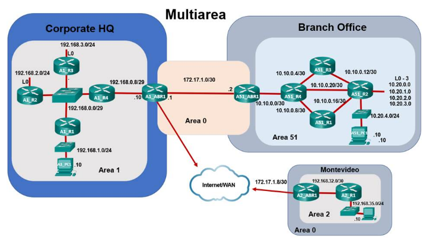

## Part 3: Configure a New Area and Attach to Area 0 Through the Internet



### Step 1: Complete the physical cabling to connect Area 0 to Area 2.

a. You should now see an icon for Montevideo. If not, adjust the scroll bars so you can see both cities and the Internet/WAN.

b. Click Connections in the Bottom Toolbar, and then click **Fiber cable**. Click Sao Paulo and select Corporate Headquarters > HQ Wiring Closet > Rack > A1_ABR1 > GigabitEthernet2/0. Next, click Internet/WAN > Internet/WAN Wiring Closet > Rack > WAN_R1 > GigabitEthernet1/0.

c. Select another fiber cable from the toolbar and, using the same procedure as above, click Internet/WAN > Internet/WAN Wiring Closet > Rack > WAN_R2 > GigabitEthernet1/0. Next, click Montevideo > Montevideo Branch Office > Montevideo Branch Office Wiring Closet > Rack > A2_ABR1 > GigabitEthernet0/0.

### Step 2: Configure OSPF on router A2_ABR1.

A2_ABR1 is already configured, with the exception of OSPF. In this step, you will configure the router to be an area border router connecting Area 2 to the rest of the network.

a. Click Montevideo to enter city view. Notice there is a Branch Office building with the fiber link you just created.

b. Click Branch Office, and then the rack icon that represents the Branch Office Wiring Closet.

c. Click A2_ABR1, and then select the CLI tab.

d. Enable OSPF on router A2_ABR1 and set the router ID to 172.17.1.10
```
A2_ABR1>enable

A2_ABR1#configure terminal

A2_ABR1(config)# router ospf 1

A2_ABR1(config-router)# router-id 172.17.1.10
```
e. Configure the 192.168.32.0/32 network to be in Area 2 and the 172.17.1.8/32 network to be in Area 0
```
A2_ABR1(config-router)# network 192.168.32.0 0.0.0.3 area 2

A2_ABR1(config-router)# network 172.17.1.8 0.0.0.3 area 0
```
f. Configure summarization on router A2_ABR1 so that it will advertise the summary network 192.168.32.0/19 into Area 0.
```
A2_ABR1(config-router)# area 2 range 192.168.32.0 255.255.224.0

A2_ABR1(config-router)#end

A2_ABR1#copy running-config startup-config
```
**Note:** Your completion percentage should now be 100%. If not, refer to the previous commands and correct any that are in error before moving on to the next step.

### Step 3: View the Area 2 summarized routes in Area 1 and Area 51.

You can use the Navigation Panel (Shift+N) in the blue tool bar at the top to quickly navigate to the wiring closets in Sao Paulo.

a. Navigate to the Sao Paulo HQ Wiring Closet. Click A1_ABR1, and then select the CLI tab. Issue the **show ip route** command. An interarea route to 192.168.32.0/19 should appear in the routing table:
```bash
O IA 192.168.32.0/19 [110/5] via 172.17.1.6, 00:14:27, GigabitEthernet2/0 #Cisco got it wrong here, this is a corrected output
```
b. Navigate to the Sao Paulo Branch Office Wiring Closet. Click A2_ABR1(A51_ABR1 instead, Cisco made a mistake here), and then select the CLI tab. Issue the **show ip route** command. An interarea route to 192.168.32.0/19 should appear in the routing table:
```bash
O IA 192.168.32.0/19 [110/6] via 172.17.1.1, 00:09:02, GigabitEthernet0/0 #Cisco got it wrong here, this is a corrected output
```

### Step 4: Test connectivity from Area 51 and Area 1 to Area 2.
a. Click A51_PC1 > Desktop tab > Command Prompt, and then ping A2_PC1.
```sh
C:\> ping 192.168.35.10

Pinging 192.168.35.10 with 32 bytes of data:

Request timed out.

Reply from 192.168.35.10: bytes=32 time<1ms TTL=120

Reply from 192.168.35.10: bytes=32 time<1ms TTL=120

Reply from 192.168.35.10: bytes=32 time<1ms TTL=120
```
b. Navigate to the Sao Paulo HQ Wiring Closet. Click A1_PC1 > Desktop tab > Command Prompt, and then ping A2_PC1.

It may take a moment to receive replies.
```sh
C:\> ping 192.168.35.10

Pinging 192.168.35.10 with 32 bytes of data:

Reply from 192.168.35.10: bytes=32 time<1ms TTL=121

Reply from 192.168.35.10: bytes=32 time<1ms TTL=121

Reply from 192.168.35.10: bytes=32 time=3ms TTL=121

Reply from 192.168.35.10: bytes=32 time<1ms TTL=121
```